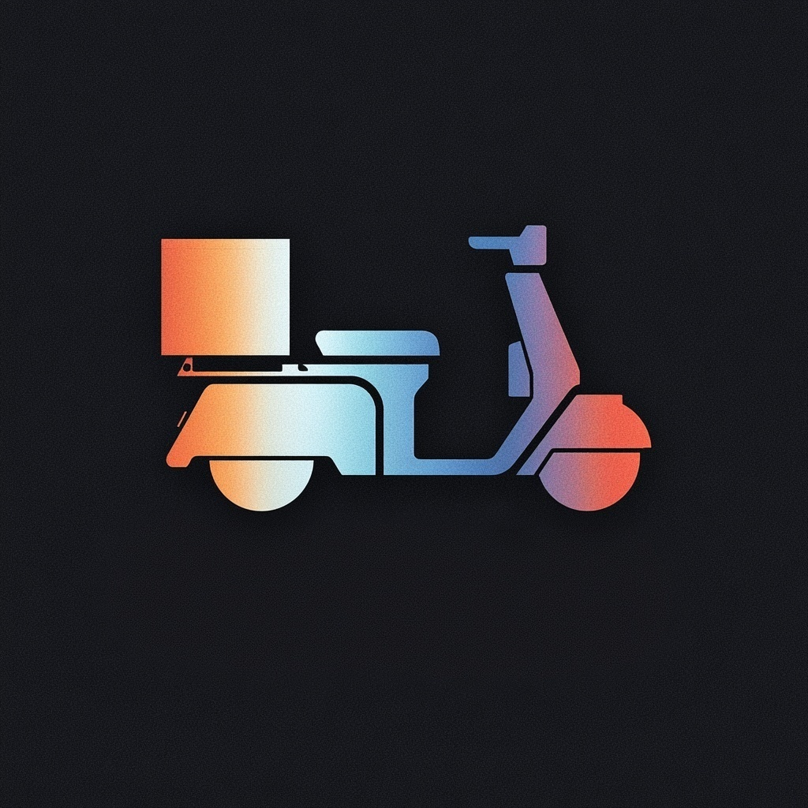

<p align="center">
  
</p>

# SideCar — AI Coding Assistant for VS Code

[](https://marketplace.visualstudio.com/items?itemName=nedonatelli.sidecar-ai)

**SideCar** is a free, self-hosted VS Code extension that serves as a drop-in replacement for GitHub Copilot and Claude Code. Use local [Ollama](https://ollama.com) models, the [Anthropic API](https://api.anthropic.com), [OpenAI](https://platform.openai.com), [Fireworks AI](https://fireworks.ai), [OpenRouter](https://openrouter.ai), [Google Gemini](https://aistudio.google.com), [Groq](https://groq.com), [AWS Bedrock](https://aws.amazon.com/bedrock/), your GitHub Copilot subscription, [Kickstand](https://github.com/nedonatelli/kickstand) (self-hosted), or any OpenAI-compatible server (vLLM, LM Studio, llama.cpp, a gateway) for AI-powered coding — with full agentic capabilities, inline completions, and tool use.

A free, open-source, local-first **autonomous AI agent for coding** — a full agent loop, not just chat. No subscription, and with local models, no data leaves your machine.

## Why SideCar?

Agent mode, tool use, and MCP are table stakes in 2026 — Copilot, Cursor, Claude Code, Cline, and Continue all have them. What sets SideCar apart is the combination underneath, all with no subscription:

- **Genuinely free and fully local-first** — runs offline on Ollama with no API key or required cloud; plug in a frontier provider only when you _want_ one.
- **Tool-call recovery from model text** — many capable local models emit their tool calls as plain text or JSON in the content field instead of the structured `tool_calls` field, so a stock harness sees no call and stalls. SideCar parses those out and runs them (`qwen2.5-coder`, for one, emits its calls as JSON in the content field). Parameter-name recovery (`file`→`path`), foreign tool-name aliases (`create_file`→`write_file`), and bare-JSON parsing sit alongside it. See [Measured, not claimed](#measured-not-claimed).
- **Capability-adaptive gates** — completion, syntax, red-check, grounding, and citation gates plus tiered reprompt budgets aimed at making weaker local models usable. Whether the net effect is a lift is [measured, not assumed](#measured-not-claimed).
- **Parallelism & write-isolation** — shadow workspaces (ephemeral git worktree), audit mode (in-memory write buffer), fork & parallel solve (N attempts, pick the winner), and typed sub-agent facets.
- **First-party VS Code integration** — Problems-panel security/diagnostics, Test Explorer agent runs, CodeLens actions, file decorations, inline completions, and inline chat.

The trade-off: SideCar is VS Code-only, where Cline and Kilo Code reach more editors and ship larger plugin ecosystems.

### vs. proprietary tools

Copilot, Cursor, and Claude Code are all capable paid agents. The comparison is no longer "agentic or not" — it's **local-first, IDE-native, and free** vs. cloud-tied and subscription-based.

| Capability                                    | SideCar                   | Copilot              | Cursor             | Claude Code               |
| --------------------------------------------- | ------------------------- | -------------------- | ------------------ | ------------------------- |
| Autonomous agent loop                         | Yes                       | Yes                  | Yes                | Yes                       |
| Model agnostic (any provider)                 | **Yes**                   | Partial              | Partial            | No                        |
| Fully offline / self-hosted                   | **Yes**                   | No                   | No                 | No                        |
| HuggingFace model install                     | **Yes**                   | No                   | No                 | No                        |
| Custom skills system                          | **Yes**                   | Yes                  | Yes (.cursorrules) | Yes                       |
| Context compaction (manual + auto)            | **Yes**                   | Yes                  | Yes                | Yes                       |
| Spending budgets & cost tracking              | **Yes**                   | Yes                  | Yes                | Yes                       |
| Hybrid local-worker delegation                | **Partial**               | No                   | No                 | No                        |
| Prompt pruner & pre-request caching           | **Yes**                   | No                   | No                 | Partial                   |
| Plan-then-execute mode                        | **Yes**                   | Yes                  | Yes                | Yes                       |
| Review mode (batch diff review)               | **Yes**                   | No                   | Partial            | No                        |
| Native Problems panel integration             | **Yes**                   | No                   | No                 | No                        |
| Test Explorer integration (agent test runs)   | **Yes**                   | No                   | No                 | No                        |
| Inline diff streaming in chat                 | **Yes**                   | No                   | No                 | No                        |
| Status bar health indicator                   | **Yes**                   | Partial              | No                 | No                        |
| Getting-started walkthrough                   | **Yes**                   | Yes                  | No                 | No                        |
| Native modal approval for destructive tools   | **Yes**                   | Partial              | Partial            | Partial                   |
| Conversation steering (type while processing) | **Yes**                   | No                   | Yes                | Yes                       |
| Works in your existing VS Code                | **Yes**                   | Yes                  | No (fork)          | Yes (extension + CLI)     |
| MCP support                                   | **Yes** (client + server) | Yes                  | Yes                | Yes                       |
| Monthly subscription                          | **Free**                  | Free tier; $10–39/mo | from $20/mo        | Usage-based / from $20/mo |

> Cursor and Windsurf (now Devin Desktop) are paid editors you switch _into_; SideCar, like Copilot and Cline, runs inside the VS Code you already use.

Beyond the differentiators above, SideCar is **cost-aware** (Anthropic prompt caching, a prompt pruner that trims oversized tool results, `delegate_task` to a local worker, spend tracking and budgets, and an architect/editor model split), **secure by default** (OS-keychain key storage, secrets/vuln scanning, path-traversal protection), and **extensible** (MCP client + server with lazy schema loading, markdown skills, six agent modes plus custom ones). No vendor lock-in: Ollama, Anthropic, OpenAI, OpenRouter, Groq, Fireworks, Gemini, AWS Bedrock, GitHub Copilot, Kickstand, any OpenAI-compatible endpoint, or GGUF from HuggingFace.

## Measured, not claimed

SideCar ships a lot of machinery aimed at making weaker local models usable —
gates, reprompt budgets, deterministic tool-call repair, recovery paths. **That
the stack as a whole makes a local model better at real tasks is not
established**, and this README does not claim it.

What has been shown:

- **Specific repairs are load-bearing.** Text-protocol call parsing is what
  lets `qwen2.5-coder` call tools at all (it emits calls as JSON in the content
  field), and stringified-array coercion is what makes `llama3.2`'s `ask_user`
  calls valid.
- **Individual mechanisms with recorded A/Bs** — noted inline where they exist,
  because a result on one model is not a general claim.

Mechanisms that cost more than they return are removed rather than kept: the
adversarial critic was removed in v0.124.0 after measuring net-negative. Each
completion gate has its own on/off setting (`sidecar.completionGate.enabled`,
`sidecar.syntaxGate.enabled`, `sidecar.redCheckGate.enabled`,
`sidecar.behavioralVerificationGate.enabled`) if you want to run leaner.

## Features

The highlights — [full feature list](https://nedonatelli.github.io/sidecar/feature-specs) in the docs.

| Feature                                       | Description                                                                                                                                                                                                                                                 |
| --------------------------------------------- | ----------------------------------------------------------------------------------------------------------------------------------------------------------------------------------------------------------------------------------------------------------- |
| **87 built-in tools**                         | File ops, shell, git, web search, databases, screenshots, code profiling, CI-failure analysis, change-impact analysis, and more — [full list](https://nedonatelli.github.io/sidecar/tools-reference)                                                        |
| **Local-model scaffolding harness**           | Capability-adaptive machinery for weaker local models: tool-call recovery from model text, grounding/completion gates, tiered reprompt budgets, and a trimmed tool catalog for local backends. Net effect is [measured, not assumed](#measured-not-claimed) |
| **Completion gate**                           | Blocks "done" until lint and colocated tests have actually run _and passed_ — keys on output evidence, not exit codes; edited files must also parse                                                                                                         |
| **Write isolation**                           | Review/Audit modes (buffer writes in-memory, approve per-file diffs) and Shadow Workspaces (run in an ephemeral `git worktree`; main tree untouched until you accept)                                                                                       |
| **Parallelism**                               | Fork & parallel solve (N attempts, pick the winner), typed sub-agent facets (named specialists with their own tool allowlist + model), and background agents                                                                                                |
| **Durable instruction memory** _(A/B-proven)_ | Standing instructions survive context compaction and the session itself, applied automatically in later sessions; review or forget them in the **Remembered Instructions** view                                                                             |
| **Project knowledge & impact**                | Semantic search over every symbol (tree-sitter + embeddings) and an AST-exact code graph — `analyze_impact` answers "what depends on this symbol?"                                                                                                          |
| **Inline completions & chat**                 | Copilot-style FIM autocomplete and `Cmd+I` in-place editing with Fix/Explain/Refactor on diagnostics                                                                                                                                                        |
| **MCP (client + server)**                     | stdio / HTTP / SSE transports with lazy schema loading; expose SideCar's own agent loop as an MCP server                                                                                                                                                    |
| **Skills**                                    | Constrained markdown skills (`allowed-tools`, `preferred-model`, `max-iterations`) with a searchable registry and 40+ slash commands                                                                                                                        |
| **SIDECAR.md**                                | Path-scoped project instructions; falls back to `AGENTS.md` / `CLAUDE.md` / `.cursorrules`                                                                                                                                                                  |
| **Security scanning**                         | Secrets, SQL injection, XSS, and eval findings surfaced in the Problems panel                                                                                                                                                                               |

## Requirements

- **Visual Studio Code** 1.116.0 or later
- **[Ollama](https://ollama.com)** installed and in your PATH (for local models only)

## Getting Started

**Switching backends:** open the ☰ menu in the chat header → **Backend**, or run `SideCar: Switch Backend` from the Command Palette. Each entry sets `sidecar.baseUrl`, `sidecar.provider`, and `sidecar.model` in one step and keeps its API key in its own SecretStorage slot, so switching never clobbers a key you already set. The per-backend sections below also give the manual settings. Full details for every backend: [docs/backends.md](docs/backends.md).

### Ollama (local, free)

1. Install [Ollama](https://ollama.com) and pull the default model: `ollama pull gemma4:e4b`
2. Install the SideCar extension
3. Click the SideCar icon in the activity bar (or `Cmd+Shift+I` / `Ctrl+Shift+I`)
4. Start chatting — SideCar launches Ollama automatically if it isn't running. If the selected model isn't installed, SideCar offers an **Install Model** action.

**Default model: `gemma4:e4b`** (9 GB, ~10 GB VRAM — the most-dogfooded local model, with the strongest prompt-following of those tested and a cold-start the harness handles automatically). Lighter alternative: `ministral-3:latest` (6 GB, 8 GB VRAM). Low-RAM: `granite4.1:3b` (2 GB). Cloud: configure the Anthropic backend for maximum reliability.

### Anthropic (Claude)

1. Open the ☰ menu in the chat header → **Anthropic Claude** under Backend
2. With no key stored yet, SideCar offers **Set API Key** — paste your key from [platform.claude.com](https://platform.claude.com) (or run `SideCar: Set / Refresh API Key` any time)

The menu entry selects `claude-haiku-4-5` (lowest cost); for agent work, `claude-sonnet-4-6` is the recommended model. Manually: `sidecar.baseUrl` = `https://api.anthropic.com`, then set `sidecar.model`.

SideCar uses Anthropic's prompt caching automatically — cache hits cost ~90% less on input tokens. The Anthropic API is billed separately from Claude.ai Pro/Max subscriptions.

### OpenAI, OpenRouter, Groq, Fireworks, Google Gemini

Pick the provider in the backend menu, then paste its key when SideCar asks (or run `SideCar: Set / Refresh API Key`). To configure by hand, set `sidecar.baseUrl` and `sidecar.model`:

| Provider      | `sidecar.baseUrl`                                         | Example `sidecar.model`                     |
| ------------- | --------------------------------------------------------- | ------------------------------------------- |
| OpenAI        | `https://api.openai.com`                                  | `gpt-5`                                     |
| OpenRouter    | `https://openrouter.ai/api/v1`                            | `anthropic/claude-sonnet-4.5`               |
| Groq          | `https://api.groq.com/openai/v1`                          | `llama-3.3-70b-versatile`                   |
| Fireworks AI  | `https://api.fireworks.ai/inference/v1`                   | `accounts/fireworks/models/deepseek-v4-pro` |
| Google Gemini | `https://generativelanguage.googleapis.com/v1beta/openai` | `gemini-2.5-flash`                          |

> **Rate limits:** SideCar's system prompt + tool schemas are ~23K tokens per request. `gpt-4o-mini` and `gpt-4.1-mini` share a 200K TPM org-level cap that exhausts after ~8 requests — use `gpt-5` or a model with a higher TPM allocation. Groq's free tier (12K–30K TPM) is exhausted after 1–2 requests; a paid tier is required for reliable use.

### AWS Bedrock

Claude models through Bedrock, with the same tool use, thinking, and streaming as the direct Anthropic backend.

1. Open the ☰ menu → **AWS Bedrock** under Backend; SideCar asks for the region (change it later with `SideCar: Bedrock: Set Region`). GovCloud regions are supported.
2. Credentials come from the standard AWS chain — `AWS_ACCESS_KEY_ID` / `AWS_SECRET_ACCESS_KEY` (+ `AWS_SESSION_TOKEN`) or `~/.aws/credentials` — or a Bedrock API key via `SideCar: Set / Refresh API Key` or `AWS_BEARER_TOKEN_BEDROCK`.
3. The model list is read live from your account; the model must be enabled for the region in the Bedrock console.

Prompt caching is not sent on the Bedrock path yet. See [docs/backends.md](docs/backends.md#aws-bedrock).

### GitHub Copilot

Route requests through your existing Copilot subscription via VS Code's Language Model API — no separate key. Requires the GitHub Copilot extension, signed in. Pick **GitHub Copilot** in the backend menu, or set `sidecar.provider` to `copilot`. Tool calling depends on the Copilot model; SideCar falls back to chat-only when it isn't supported.

### Kickstand (self-hosted)

[Kickstand](https://github.com/nedonatelli/kickstand) is a self-hosted inference server (CLI: `kick`) that loads, unloads, and runs GGUF and MLX models with GPU acceleration.

1. Start it with `kick start` — it auto-generates a bearer token at `~/.config/kickstand/token`
2. Pick **Kickstand** in the backend menu, or set `sidecar.baseUrl` to `http://localhost:11435`
3. SideCar reads the token file automatically — no API key prompt needed

### Custom endpoint (any OpenAI-compatible server)

vLLM, LM Studio, llama.cpp, mlx-lm, or a gateway: pick **Custom endpoint** in the backend menu and enter the server's URL, then its API key (leave it empty if the server doesn't need one — no `Authorization` header is sent). Or configure it by hand:

1. Set `sidecar.provider` to `openai-compat` and `sidecar.baseUrl` to your server URL (e.g. `http://localhost:8000`; a trailing `/v1` is optional)
2. Set `sidecar.model` to the model name on your server
3. Run `SideCar: Set / Refresh API Key` if your server requires authentication

SideCar reads the model's context window from the server's `/v1/models` (`max_model_len` on vLLM), so history is compacted before a request can overflow it. A server on `localhost` gets the same prompt-size cap and trimmed tool catalog as local Ollama. vLLM needs `--enable-auto-tool-choice` and `--tool-call-parser` for the agent to call tools — see the [launch example](docs/backends.md#vllm).

## Tested Models

SideCar is verified against an agent smoke-eval suite (read / edit / write / run / plan / error-recovery tasks) on each supported model. The primary gate is **infrastructure reliability** — the agent loop, tool-call parsing, and completion gates must run cleanly (no crashes, dropped tool calls, or retry thrash) — measured separately from a model's raw task capability.

**Test hardware:** local models were first qualified on an Apple M3 Max laptop with 36 GB of unified memory (macOS); current testing runs on a Windows workstation with an NVIDIA RTX 5090 (32 GB VRAM) and 128 GB of system RAM. Both use Ollama for local models. Memory guidance for each is below.

### Local models (Ollama)

Every model below runs the agent smoke suite with **zero infrastructure errors**. Task-completion capability varies; the recommendations reflect both.

| Model                    | Size   | Notes                                                                              |
| ------------------------ | ------ | ---------------------------------------------------------------------------------- |
| **gemma4:e4b** (default) | 9.6 GB | Strongest prompt-following of the local models; the shipped default                |
| **ornith:9b**            | 5.6 GB | Best small-footprint agent — near-default capability at a third the size           |
| **ministral-3:latest**   | 6.0 GB | Strong, low-footprint, reliable                                                    |
| **qwen2.5-coder:7b**     | 4.7 GB | Solid coding baseline; emits text-form tool calls (SideCar's parser recovers them) |
| north-mini-code:1.0      | 19 GB  | Agentic-tuned coder; strong autonomous, but rarely asks clarifying questions       |
| laguna-xs-2.1            | 20 GB  | Fast MoE coder; some run-to-run variance                                           |
| granite4.1:3b            | 2.1 GB | Low-RAM option; punches above its weight                                           |
| llama3.2:latest          | 2.0 GB | Low-RAM general model; below the agent floor for complex tasks                     |

**Not recommended:** `lfm2.5` — in qualification it reproducibly obeyed a fenced prompt injection.

**Memory guidance — Apple Silicon, 36 GB unified memory.** Sub-10 GB models run comfortably alongside VS Code with headroom for the context cache; the ~19–20 GB MoE coders fit with less room to spare. A dense 14B model at a large context window can exceed unified memory and thrash — lower `sidecar.ollama.numCtx`, or prefer a smaller coder.

**Memory guidance — discrete GPU (tested on 32 GB VRAM).** What matters is VRAM, not system RAM: the model's weights _and_ its context cache must fit on the GPU, or Ollama moves layers to the CPU and generation slows sharply. The context cache grows with the window — `gemma4:e4b` at its full 131K context occupies about 9.7 GB of VRAM. If a larger model runs slowly, check `ollama ps` (the `PROCESSOR` column should read 100% GPU) and lower `sidecar.ollama.numCtx` before switching models.

More per-model detail: [Model Compatibility](docs/model-compatibility.md).

### Cloud models

For maximum reliability, the **Anthropic (Claude)**, **Google Gemini**, and **Fireworks (DeepSeek)** backends are the strongest tested cloud options; see the setup sections above.

## VS Code Copilot Chat & Agents Window

SideCar registers as a native VS Code chat participant — type `@sidecar` in the Copilot Chat panel to talk to your configured backend without opening the SideCar sidebar. Slash commands `/review`, `/fix`, `/explain`, and `/commit-message` are available.

**VS Code Agents Window (Preview):** To use SideCar in the dedicated [Agents Window](https://code.visualstudio.com/docs/copilot/agents/agents-window), add the following to your VS Code `settings.json`:

```json
"extensions.supportAgentsWindow": {
    "nedonatelli.sidecar-ai": true
}
```

The extension must be installed in your default VS Code profile.

## Keyboard Shortcuts

| Shortcut                       | Action                           |
| ------------------------------ | -------------------------------- |
| `Cmd+Shift+I` / `Ctrl+Shift+I` | Toggle SideCar chat panel        |
| `Cmd+I` / `Ctrl+I`             | Inline chat (edit code in place) |
| `Cmd+L` / `Ctrl+L`             | Clear chat                       |
| `Cmd+Shift+U` / `Ctrl+Shift+U` | Undo all AI changes              |
| `Cmd+Shift+E` / `Ctrl+Shift+E` | Export chat as Markdown          |

## Extension Settings

Core settings — full reference at [nedonatelli.github.io/sidecar/configuration](https://nedonatelli.github.io/sidecar/configuration).

| Setting                                | Default                  | Description                                                                                    |
| -------------------------------------- | ------------------------ | ---------------------------------------------------------------------------------------------- |
| `sidecar.baseUrl`                      | `http://localhost:11434` | API base URL                                                                                   |
| `sidecar.model`                        | `gemma4:e4b`             | Model for chat                                                                                 |
| `sidecar.provider`                     | `auto`                   | Backend adapter; `auto` detects from the URL. `openai-compat` for any OpenAI-compatible server |
| `sidecar.agentMode`                    | `cautious`               | `cautious` / `autonomous` / `manual` / `plan` / `review` / `audit` or a custom mode name       |
| `sidecar.agentMaxIterations`           | `50`                     | Max agent loop iterations                                                                      |
| `sidecar.agentMaxTokens`               | `200000`                 | Max tokens per agent run                                                                       |
| `sidecar.mcpServers`                   | `{}`                     | MCP server definitions (or use `.mcp.json`)                                                    |
| `sidecar.toolPermissions`              | `{}`                     | Per-tool overrides: `allow` / `deny` / `ask`                                                   |
| `sidecar.hooks`                        | `{}`                     | Pre/post execution hooks per tool                                                              |
| `sidecar.completionGate.enabled`       | `true`                   | Block agent finish until lint + tests pass                                                     |
| `sidecar.enableInlineCompletions`      | `false`                  | Copilot-style autocomplete (opt-in)                                                            |
| `sidecar.mcpDelegation.enabled`        | `false`                  | Enable `delegate_to_mcp` tool (agent → MCP server)                                             |
| `sidecar.mcpDelegation.allowedServers` | `[]`                     | Allowlist of servers `delegate_to_mcp` may target (empty = all)                                |
| `sidecar.mcpServer.enabled`            | `false`                  | Expose SideCar's agent loop as a local MCP server                                              |
| `sidecar.mcpServer.port`               | `3457`                   | Port for the SideCar MCP server (127.0.0.1 only)                                               |
| `sidecar.mcpServer.requireAuth`        | `true`                   | Require bearer token for inbound MCP requests                                                  |
| `sidecar.dailyBudget`                  | `0` (off)                | Daily spend cap in USD (paid backends)                                                         |
| `sidecar.weeklyBudget`                 | `0` (off)                | Weekly spend cap in USD (paid backends)                                                        |

API keys are stored in VS Code SecretStorage (OS keychain) — set via `SideCar: Set / Refresh API Key`, never in plaintext settings.

## Documentation

Full documentation: [nedonatelli.github.io/sidecar](https://nedonatelli.github.io/sidecar/)

- **[docs/backends.md](docs/backends.md)** — setup, tuning, and limits for every backend
- **[docs/model-compatibility.md](docs/model-compatibility.md)** — which local models work for agent mode, and which to avoid
- **[SECURITY.md](SECURITY.md)** — threat model, secret-pattern catalog, vulnerability disclosure
- **[docs/extending-sidecar.md](docs/extending-sidecar.md)** — skills, custom tools, MCP servers, policy hooks
- **[CHANGELOG.md](CHANGELOG.md)** — per-release notes
- **[CONTRIBUTING.md](CONTRIBUTING.md)** — building, testing, and contributing
- Architecture diagrams: [agent loop](docs/agent-loop-diagram.md) · [tool dispatch](docs/tool-system-diagram.md) · [context pipeline](docs/context-pipeline-diagram.md) · [MCP lifecycle](docs/mcp-lifecycle-diagram.md)

## Support & Contact

- **Bug reports & feature requests**: [GitHub Issues](https://github.com/nedonatelli/sidecar/issues)
- **Security issues**: private disclosure via [SECURITY.md](SECURITY.md) — please don't open public issues for vulnerabilities
- **Email**: [sidecarai.vscode@gmail.com](mailto:sidecarai.vscode@gmail.com)
- **Documentation**: [nedonatelli.github.io/sidecar](https://nedonatelli.github.io/sidecar/)

SideCar is free and always will be. If it saves you time and you'd like to support development, a tip is appreciated but never required:

<a href="https://www.buymeacoffee.com/nedonatelli" target="_blank"></a>

## Disclaimer

SideCar is an independent project by Nicholas Donatelli and is not affiliated with, endorsed by, or sponsored by Ollama, Anthropic, Meta, Mistral AI, Google, GitHub, or any other company. All product names are trademarks of their respective holders.

## License

[MIT](LICENSE)
