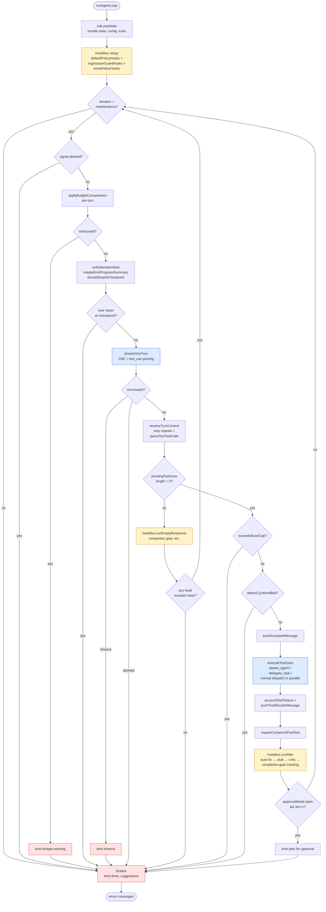
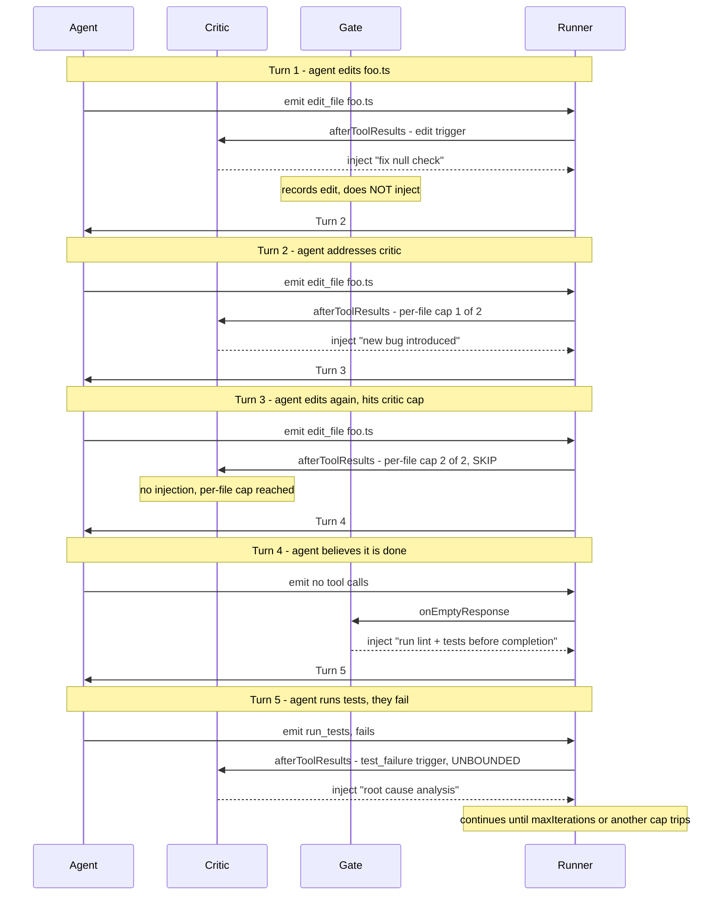
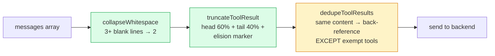

# Agent Loop Architecture

The agent loop is the core iteration engine that drives every SideCar agentic interaction. It lives in [`src/agent/loop.ts`](../src/agent/loop.ts) as a thin 255-line orchestrator that reads top-to-bottom as one iteration's pseudo-code. Every meaningful chunk of logic is delegated to a single-purpose helper under [`src/agent/loop/`](../src/agent/loop/).

## One iteration at a glance



## Submodule map

The orchestrator in [`loop.ts`](../src/agent/loop.ts) calls into focused helpers under [`src/agent/loop/`](../src/agent/loop/):

| Helper | Responsibility |
| --- | --- |
| [`state.ts`](../src/agent/loop/state.ts) | `initLoopState` bundles immutable inputs + mutable accumulators into one `LoopState` object |
| [`compression.ts`](../src/agent/loop/compression.ts) | `applyBudgetCompression` (pre-turn) + `maybeCompressPostTool` (after tool results) |
| [`streamTurn.ts`](../src/agent/loop/streamTurn.ts) | `streamOneTurn` owns the streamChat request loop with per-event timeout + abort handling; captures partial text for `/resume` on mid-stream failure |
| [`textParsing.ts`](../src/agent/loop/textParsing.ts) | `resolveTurnContent` → `parseTextToolCalls` + `stripRepeatedContent` for models that emit tool calls as text (qwen3, Hermes) instead of structured tool_use |
| [`cycleDetection.ts`](../src/agent/loop/cycleDetection.ts) | `exceedsBurstCap` (max tools per iteration) + `detectCycleAndBail` (ring buffer of recent tool+args tuples) |
| [`messageBuild.ts`](../src/agent/loop/messageBuild.ts) | `pushAssistantMessage` + `pushToolResultsMessage` + `accountToolTokens` — single source of truth for message-array mutation |
| [`executeToolUses.ts`](../src/agent/loop/executeToolUses.ts) | Parallel tool dispatch; special-cases `spawn_agent` + `delegate_task`; threads `cwdOverride` into every `ToolExecutorContext` |
| [`policyHook.ts`](../src/agent/loop/policyHook.ts) | `HookBus` + `PolicyHook` interface. Hooks fire via `runAfter` (post-tool) and `runEmptyResponse` (no tool calls this turn) |
| [`builtInHooks.ts`](../src/agent/loop/builtInHooks.ts) | `defaultPolicyHooks()` wraps the four built-ins as `PolicyHook` adapters |
| [`criticHook.ts`](../src/agent/loop/criticHook.ts) | Adversarial critic — spawns a second LLM call to review the agent's edits; can push a synthetic user message demanding more work |
| [`gate.ts`](../src/agent/loop/gate.ts) | Completion gate — refuses to let the agent end the turn without running lint/tests when it claims to be done |
| [`stubCheck.ts`](../src/agent/loop/stubCheck.ts) | Post-tool validator that rejects placeholder code (`TODO`, `// implement me`, …) |
| [`notifications.ts`](../src/agent/loop/notifications.ts) | `notifyIterationStart` + `maybeEmitProgressSummary` + `shouldStopAtCheckpoint` (user interrupt every N iterations) |
| [`finalize.ts`](../src/agent/loop/finalize.ts) | Post-loop teardown + next-step suggestion synthesis |

## Hook bus ordering

The `HookBus` runs hooks in registration order:

1. **Built-ins** (auto-fix → stub validator → critic → completion-gate tracking) — registered first via `defaultPolicyHooks()`.
2. **Regression guards** — loaded from `sidecar.regressionGuards` config, gated behind `checkWorkspaceConfigTrust`.
3. **User extras** — `options.extraPolicyHooks` registered last. These see every mutation earlier hooks made to `state.messages`.

Two hook phases:

- **`afterToolResults`** (`hookBus.runAfter`) — fires after every successful tool-execution turn. Hooks may push synthetic user messages that demand more work.
- **`emptyResponse`** (`hookBus.runEmptyResponse`) — fires when the model produced no tool calls. Any hook that mutates state keeps the loop alive; if none mutate, the loop naturally terminates.

## Critic × Completion Gate interaction

Both the adversarial critic and the completion gate can push synthetic user messages into `state.messages`. They look superficially similar — both are post-turn policies that might keep the loop alive — but they fire in **different phases** and at **different moments in the turn**:

| Hook | Phase | Fires when | Can inject? |
| --- | --- | --- | --- |
| `autoFix` | `afterToolResults` | Lint / build / test errors detected post-edit | ✅ |
| `stubValidator` | `afterToolResults` | Placeholder code (`TODO`, `// implement me`) detected in the write | ✅ |
| `adversarialCritic` | `afterToolResults` | After `write_file` / `edit_file` / failed `run_tests` | ✅ |
| `completionGate` *(tool recording)* | `afterToolResults` | Every turn — feeds gate state with tool uses | ❌ never |
| `completionGate` *(gate check)* | `emptyResponse` | Model tried to terminate without verifying edits | ✅ |

Because the critic fires in `afterToolResults` and the gate's **injecting** method (`onEmptyResponse`) fires in `emptyResponse`, **they cannot both inject on the same turn** — those are mutually exclusive branches in [`loop.ts`](../src/agent/loop.ts). The gate's `afterToolResults` method runs on every turn but is purely for tool-use tracking; it never pushes a message.

What does happen across **successive iterations** is more subtle:



### Bounds that prevent infinite loops

- **Critic — per-file injection cap.** `MAX_CRITIC_INJECTIONS_PER_FILE = 2` in [`src/agent/loop/criticHook.ts`](../src/agent/loop/criticHook.ts) — after two critic blocks on the same file within a run, the critic skips further blocks for that file. **Applies to `edit` triggers only.**
- **Critic — test-failure triggers are NOT per-file-capped.** The per-file counter is keyed by `filePath`, and `test_failure` triggers don't name a single file. A gate-forced test run that keeps failing can keep firing the critic turn after turn. In practice this is bounded by the outer iteration cap; in the worst case you burn critic calls (Haiku: ~$0.02 each on Anthropic backends) until `maxIterations` trips.
- **Gate — total injection cap.** `MAX_GATE_INJECTIONS = 2` in [`src/agent/loop/gate.ts`](../src/agent/loop/gate.ts). After two gate reprompts in a run, the gate logs a warning and allows termination with unverified edits rather than looping forever.
- **Loop — iteration cap.** `sidecar.agentMaxIterations` (default 25). Ultimate backstop.
- **Cycle detection.** Same tool+args tuple repeated N times triggers `detectCycleAndBail`.
- **Burst cap.** Too many tools attempted in one iteration triggers `exceedsBurstCap`.

### Known lockup-risk scenario

The realistic worst case is **gate → test failure → critic loop**:

1. Agent edits, gate's per-file critic cap exhausts (2 blocks).
2. Agent tries to terminate; gate injects "run tests."
3. Tests fail; critic `test_failure` trigger fires (unbounded per-file).
4. Agent edits to fix, but edit triggers are now capped for these files.
5. Repeat steps 2–4 until `MAX_GATE_INJECTIONS` (2) is hit or `maxIterations` (25) trips.

You can burn 20+ iterations and 10+ critic calls before the outer cap fires. For a user on Sonnet with critic defaulting to Haiku, that's **~$1–2 of API spend** on a single stuck turn.

### Escape hatches for a stuck loop

1. **Abort** via the chat UI (cancel button) — `signal.aborted` is checked between iterations and the loop exits immediately.
2. **Disable the critic** for the session: `sidecar.critic.enabled: false` (or toggle via the settings UI's new "SideCar: Safety & Review" section).
3. **Disable the gate**: `sidecar.completionGate.enabled: false`.
4. **Lower `sidecar.agentMaxIterations`** to cap spend per run.
5. **Inspect `SideCar: Show Session Spend`** — the critic session-stats view added in v0.62.1 shows `blockedTurns` + `lastBlockedReason` so you can tell whether the critic is what's looping.

### Why the test-failure trigger is unbounded

It's a deliberate design trade, not an oversight: a test that keeps failing for *different reasons* across iterations is exactly the situation where the critic's analysis is most valuable. Bounding test-failure triggers per-file would mute the critic precisely when an agent is flailing. The unbounded behavior is bounded-enough-in-practice by `maxIterations` + `MAX_GATE_INJECTIONS`. A future improvement would be a per-test-output hash cap (don't re-fire the critic when the test output hasn't materially changed) — tracked as an open item.

## Prompt pruner safety model

The [`promptPruner`](../src/ollama/promptPruner.ts) runs in the backend layer on every request to a paid backend (Anthropic / OpenAI-compatible). It's a lossy-but-bounded transform that protects against three scenarios:

1. **Oversize tool_result blocks** (e.g., a `read_file` on a 100KB file) that would crowd out the conversation history.
2. **Duplicate reads of the same file** across a turn (agent reads foo.ts three times).
3. **Trailing whitespace runs** from tool outputs that pad the prompt without carrying signal.

### Three transforms, one contract



The contract is: the pruner **NEVER** touches user message text, assistant reasoning, or tool_use inputs. It only transforms `tool_result` blocks and whitespace in between. This keeps the pruner safe to enable by default (`sidecar.promptPruning.enabled: true`).

### Which transforms apply to which tools

- **`collapseWhitespace`** — applied universally. Runs of 3+ blank lines become 2. No user-visible impact; preserves all non-whitespace signal.
- **`truncateToolResult`** — applied to **every** tool_result block that exceeds `sidecar.promptPruning.maxToolResultTokens` (default ~4K tokens). Head + tail + elision marker preserves the error signal at the top AND the failing line at the bottom — which is where the signal lives in 90% of tool output (compile errors, test failures, file reads where the function of interest is near a function signature).
- **`dedupeToolResults`** — applied to most tool_result blocks, but **EXEMPT** for a specific set:

  ```typescript
  const DEDUP_EXEMPT_TOOLS = new Set([
    'read_file',       // agent reads foo.ts, edits it, re-reads it — MUST see new content
    'get_diagnostics', // lint/type errors change after edits
    'git_diff',        // diff vs. HEAD changes after every stage/commit
    'git_status',      // working-tree state changes after every tool call
  ]);
  ```

  These tools' outputs are **expected to vary across consecutive calls with identical inputs**. Dedup'ing them with a back-reference ("identical to previous tool_result") is a trap: the agent gets the *stale* content by reference even though it wrote a newer version. The audit finding that added this exemption (v0.62.1 p.2b) caught exactly this trap in an eval scenario where the agent couldn't tell its own edit had landed.

  **Truncation still applies to exempt tools** — size management is always legitimate; the exemption is only about the back-reference shortcut.

### How to decide whether to exempt a new tool

Check both questions. Answer "yes" to either → add to `DEDUP_EXEMPT_TOOLS`:

1. **Does this tool's output vary meaningfully across consecutive calls with identical inputs?**
   - Yes for `read_file` (file contents change), `list_directory` (may change if the agent creates files), `git_status` (tree state mutates), `get_diagnostics` (errors resolve).
   - No for `search_files` with a fixed query (should be stable; dedup is safe).

2. **Would collapsing identical outputs into a back-reference lose user intent the agent needs?**
   - Yes for diff-like tools where the agent is tracking changes over time.
   - No for most read-only knowledge tools (`web_search`, `find_references`) — if the agent re-runs the same search, dedup is fine.

When in doubt, lean toward exempting. The cost of a false exemption is a few extra bytes in the prompt; the cost of a false dedup is an agent that can't see its own work.

### Observability

The pruner emits a `PruneStats` object on every request:

- `truncatedBytes` — total bytes dropped by head+tail truncation.
- `dedupedBytes` — total bytes saved by dedup (back-references).
- `whitespaceBytes` — total bytes saved by whitespace collapse.
- `truncatedByTool` — per-tool breakdown of truncation (e.g., `{ read_file: 12000, run_command: 4000 }`).

When any of these is non-zero, `formatPruneStats(stats)` emits a one-line summary to the SideCar output channel (`console.info`). Users who see "did the pruner eat my error message?" can look at the log to answer conclusively.

## Termination paths

The loop can exit via any of:

- **Natural end**: model produced no tool calls and no hook wanted to reprompt.
- **Plan mode**: first iteration completed, `onPlanGenerated` fired for user approval.
- **Iteration cap**: `state.iteration >= state.maxIterations`.
- **Abort**: `signal.aborted` between iterations or mid-stream.
- **Budget exhaustion**: `applyBudgetCompression` couldn't fit under `maxTokens`.
- **Burst cap**: too many tools attempted in one iteration.
- **Cycle detected**: same tool+args tuple seen too many times in the recent ring.
- **Timeout**: a single stream turn exceeded `sidecar.requestTimeout`.
- **Checkpoint refused**: `onCheckpoint` returned `false`.

All paths route through `finalize(state, callbacks)` which emits the final `onDone` callback and synthesizes next-step suggestions.

## Per-run isolation

`options.toolRuntime` is a per-run `ToolRuntime` carrying the persistent shell session + symbol-graph reference. [`BackgroundAgentManager`](../src/agent/backgroundAgent.ts) creates a fresh `ToolRuntime` per run and disposes it in `finally` so parallel background agents don't share a shell — two agents both doing `cd` or `export` would otherwise trample each other. `options.cwdOverride` pins every tool call's working directory, used by Shadow Workspaces to route fs writes into an ephemeral git worktree.
