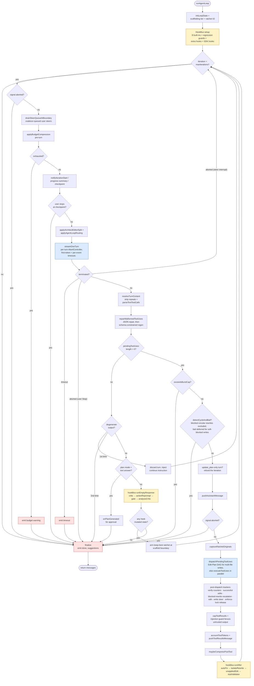
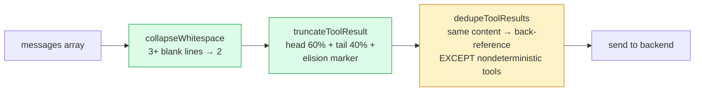
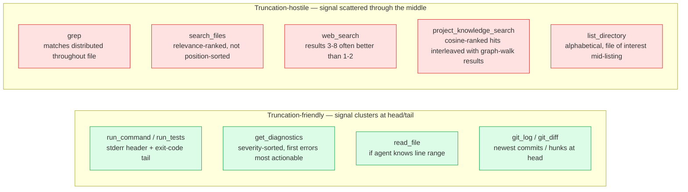

# Agent Loop Architecture

The agent loop is the core iteration engine that drives every SideCar agentic interaction. It lives in [`src/agent/loop.ts`](../src/agent/loop.ts) as a ~900-line orchestrator whose `while` body reads top-to-bottom as one iteration's pseudo-code, with every meaningful chunk of logic delegated to a single-purpose helper under [`src/agent/loop/`](../src/agent/loop/) (28 modules). All run state — immutable inputs and mutable accumulators alike — lives on one `LoopState` object (`state.ts`) that the helpers mutate through a single reference.

## One iteration at a glance

```mermaid
flowchart TD
    Start([runAgentLoop]) --> Init[initLoopState +<br/>scaffolding tier + ratchet IO]
    Init --> Bus[HookBus setup<br/>8 built-ins + regression guards +<br/>extra hooks + SDK hooks]
    Bus --> Loop{iteration <<br/>maxIterations?}
    Loop -- no --> Finalize[finalize<br/>emit done, suggestions]
    Finalize --> Return([return messages])

    Loop -- yes --> Abort{signal.aborted?}
    Abort -- yes --> Finalize
    Abort -- no --> Steer[drainSteerQueueAtBoundary<br/>coalesce queued user steers]
    Steer --> Compress[applyBudgetCompression<br/>pre-turn]
    Compress --> Exhausted{exhausted?}
    Exhausted -- yes --> BudgetBreak[emit budget warning] --> Finalize
    Exhausted -- no --> Notify[notifyIterationStart /<br/>progress summary / checkpoint]
    Notify --> Checkpoint{user stops<br/>at checkpoint?}
    Checkpoint -- yes --> Finalize
    Checkpoint -- no --> Route[applyArchitectEditorSplit +<br/>applyAgentLoopRouting]
    Route --> Stream[streamOneTurn<br/>per-turn AbortController,<br/>first-token + per-event timeouts]

    Stream --> Terminated{terminated?}
    Terminated -- timeout --> TimeoutMsg[emit timeout] --> Finalize
    Terminated -- "aborted (user Stop)" --> Finalize
    Terminated -- "aborted (steer interrupt)" --> Loop
    Terminated -- no --> Resolve[resolveTurnContent<br/>strip repeats +<br/>parseTextToolCalls]
    Resolve --> Repair[repairMalformedToolUses<br/>JSON repair, then<br/>schema-constrained regen]

    Repair --> HasTools{pendingToolUses<br/>length > 0?}

    HasTools -- no --> Degen{degenerate<br/>output?}
    Degen -- "1st time" --> DegenRetry[discard turn, inject<br/>continue instruction] --> Loop
    Degen -- "2nd time" --> Finalize
    Degen -- no --> PlanCheck{plan mode +<br/>text answer?}
    PlanCheck -- yes --> PlanEmit[onPlanGenerated<br/>for approval] --> Finalize
    PlanCheck -- no --> EmptyHook[hookBus.runEmptyResponse<br/>critic → actionReprompt →<br/>gate → analysisCritic]
    EmptyHook --> Mutated{any hook<br/>mutated state?}
    Mutated -- yes --> RatchetArm[arm keep-best ratchet at<br/>scaffold boundary] --> Loop
    Mutated -- no --> Finalize

    HasTools -- yes --> Burst{exceedsBurstCap?}
    Burst -- yes --> Finalize
    Burst -- no --> Cycle{detectCycleAndBail?<br/>blocked circular rewrites excluded,<br/>bail deferred for soft-blocked writes}
    Cycle -- yes --> Finalize
    Cycle -- no --> PlanRefund[update_plan-only turn?<br/>refund the iteration]
    PlanRefund --> PushAsst[pushAssistantMessage]
    PushAsst --> Abort2{signal.aborted?}
    Abort2 -- yes --> Finalize
    Abort2 -- no --> RatchetCap[captureRatchetOriginals]
    RatchetCap --> Exec[dispatchPendingToolUses<br/>Edit-Plan DAG for multi-file writes,<br/>else executeToolUses in parallel]
    Exec --> Trackers[post-dispatch trackers:<br/>verify counters · successful edits ·<br/>blocked-rewrite escalation ·<br/>edit→write steer · enforce-lock release]
    Trackers --> Cap[capToolResults +<br/>injection guard fences<br/>untrusted output]
    Cap --> Account[accountToolTokens +<br/>pushToolResultsMessage]
    Account --> PostCompress[maybeCompressPostTool]
    PostCompress --> AfterHook[hookBus.runAfter<br/>autoFix → isolateRewrite →<br/>unappliedEdit → stubValidator]
    AfterHook --> Loop

    classDef hookStyle fill:#fef3c7,stroke:#d97706
    classDef toolStyle fill:#dbeafe,stroke:#2563eb
    classDef terminalStyle fill:#fee2e2,stroke:#dc2626
    class Bus,EmptyHook,AfterHook hookStyle
    class Stream,Exec toolStyle
    class BudgetBreak,TimeoutMsg,Finalize terminalStyle
```

Two things the flowchart compresses:

- **Steer interrupts vs. user Stop.** Each iteration owns an inner `AbortController` linked to the outer signal. An `interrupt`-urgency steer aborts only the in-flight stream; the loop continues, and the next iteration drains the queued steer. A real user Stop aborts everything, and any tool calls that were queued but never executed are surfaced (`⚠️ Stopped — cancelled in-flight: …`).
- **Plan-turn refund.** An `update_plan`-only turn is harness-demanded bookkeeping and does not consume the iteration budget, bounded by `MAX_PLAN_STEPS` free turns per run.

## Submodule map

The orchestrator in [`loop.ts`](../src/agent/loop.ts) calls into focused helpers under [`src/agent/loop/`](../src/agent/loop/):

| Helper                                                                                                                                  | Responsibility                                                                                                                                                                     |
| --------------------------------------------------------------------------------------------------------------------------------------- | ---------------------------------------------------------------------------------------------------------------------------------------------------------------------------------- |
| [`state.ts`](../src/agent/loop/state.ts)                                                                                                | `initLoopState` bundles immutable inputs + mutable accumulators into one `LoopState`; owns `DEFAULT_MAX_ITERATIONS` (50)                                                           |
| [`steerDrain.ts`](../src/agent/loop/steerDrain.ts)                                                                                      | `drainSteerQueueAtBoundary` — coalesces queued user steers into one message at the iteration boundary                                                                              |
| [`compression.ts`](../src/agent/loop/compression.ts)                                                                                    | `applyBudgetCompression` (pre-turn) + `maybeCompressPostTool` (after tool results)                                                                                                 |
| [`routing.ts`](../src/agent/loop/routing.ts)                                                                                            | `applyArchitectEditorSplit` (planning vs. tool-execution model) + `applyAgentLoopRouting` (role-based model router)                                                                |
| [`streamTurn.ts`](../src/agent/loop/streamTurn.ts)                                                                                      | `streamOneTurn` owns the streamChat request with first-token + per-event timeouts and abort handling; captures partial text for `/resume` on mid-stream failure                    |
| [`textParsing.ts`](../src/agent/loop/textParsing.ts)                                                                                    | `resolveTurnContent` → `parseTextToolCalls` + `stripRepeatedContent` for models that emit tool calls as text (qwen, Hermes, bare/fused JSON, kwarg call expressions)               |
| [`toolCallRepair.ts`](../src/agent/loop/toolCallRepair.ts)                                                                              | `repairMalformedToolUses` — heuristic JSON repair, then schema-constrained regeneration, before dispatch                                                                           |
| [`cycleDetection.ts`](../src/agent/loop/cycleDetection.ts)                                                                              | `exceedsBurstCap` (max tools per iteration) + `detectCycleAndBail` (ring buffer of recent tool+args tuples)                                                                        |
| [`circularRewrite.ts`](../src/agent/loop/circularRewrite.ts)                                                                            | Byte-identical rewrite tracking: soft-block exclusions for cycle detection, blocked-rewrite escalation, edit→write steer, enforce-lock release                                     |
| [`messageBuild.ts`](../src/agent/loop/messageBuild.ts)                                                                                  | `pushAssistantMessage` + `pushToolResultsMessage` + `accountToolTokens` — single source of truth for message-array mutation                                                        |
| [`dispatchToolUses.ts`](../src/agent/loop/dispatchToolUses.ts)                                                                          | Turn-level dispatch: routes pure-write multi-file turns through the Edit-Plan DAG (`multiFileEdit.ts`), everything else to `executeToolUses`                                       |
| [`executeToolUses.ts`](../src/agent/loop/executeToolUses.ts)                                                                            | Parallel tool dispatch; special-cases `spawn_agent` + `delegate_task`; threads `cwdOverride` into every `ToolExecutorContext`                                                      |
| [`multiFileEdit.ts`](../src/agent/loop/multiFileEdit.ts)                                                                                | Edit-Plan pass + bounded-parallelism DAG walk for large multi-file write turns                                                                                                     |
| [`toolBudget.ts`](../src/agent/loop/toolBudget.ts)                                                                                      | `capToolResults` — in-loop size cap on tool results before token accounting                                                                                                        |
| [`policyHook.ts`](../src/agent/loop/policyHook.ts)                                                                                      | `HookBus` + `PolicyHook` interface. Four phases: `beforeIteration`, `afterToolResults`, `onEmptyResponse`, `onTermination`                                                         |
| [`builtInHooks.ts`](../src/agent/loop/builtInHooks.ts)                                                                                  | `defaultPolicyHooks()` wraps the eight built-ins (autoFix · isolateRewrite · unappliedEdit · stubValidator · adversarialCritic · actionReprompt · completionGate · analysisCritic) |
| [`autoFix.ts`](../src/agent/loop/autoFix.ts)                                                                                            | Lint/build/test error follow-up nudge after edits                                                                                                                                  |
| [`isolateRewrite.ts`](../src/agent/loop/isolateRewrite.ts)                                                                              | Nudges a model that full-file-rewrites toward targeted `edit_file` changes before cycle detection bails                                                                            |
| [`unappliedEdit.ts`](../src/agent/loop/unappliedEdit.ts)                                                                                | The mirror nudge: model described an edit in a fence but applied nothing — redirects to an actual mutation tool. One injection per run                                             |
| [`stubCheck.ts`](../src/agent/loop/stubCheck.ts)                                                                                        | Post-tool validator that rejects placeholder code (`TODO`, `// implement me`, …)                                                                                                   |
| [`criticHook.ts`](../src/agent/loop/criticHook.ts)                                                                                      | Adversarial critic — reviews the run's **cumulative diff at completion** (see below). Default off                                                                                  |
| [`gate.ts`](../src/agent/loop/gate.ts)                                                                                                  | Completion gate — refuses to let the agent end the turn without verifying its edits; also hosts the syntax gate (own bounded retries)                                              |
| [`forceFinalAnswer.ts`](../src/agent/loop/forceFinalAnswer.ts)                                                                          | Answer-forcing for runs that end tool-heavy with no user-facing answer                                                                                                             |
| [`keepBestRatchet.ts`](../src/agent/loop/keepBestRatchet.ts) / [`keepBestRatchetWiring.ts`](../src/agent/loop/keepBestRatchetWiring.ts) | Keep-best ratchet: baselines pre-edit content, captures the scaffold boundary, reverts unproven scaffold-tail growth (default on since v0.118)                                     |
| [`syntaxGate.ts`](../src/agent/loop/syntaxGate.ts)                                                                                      | Deterministic post-edit syntax verification feeding the gate                                                                                                                       |
| [`notifications.ts`](../src/agent/loop/notifications.ts)                                                                                | `notifyIterationStart` + `maybeEmitProgressSummary` + `shouldStopAtCheckpoint` (user interrupt every N iterations)                                                                 |
| [`finalize.ts`](../src/agent/loop/finalize.ts)                                                                                          | Post-loop teardown + next-step suggestion synthesis — runs on every exit path, including the throw path                                                                            |

## Hook bus ordering

The `HookBus` runs hooks in registration order and supports four phases: `beforeIteration`, `afterToolResults`, `onEmptyResponse`, and `onTermination`. A phase runs **every** registered hook that implements it (it does not stop at the first mutation) and reports whether any hook mutated state. A hook that throws raises `PolicyEnforcementError`, which halts the run cleanly.

Registration order:

1. **Built-ins** — registered first via `defaultPolicyHooks()`, eight of them.
2. **Regression guards** — loaded from `sidecar.regressionGuards` config, gated behind the workspace-trust prompt.
3. **User extras** — `options.extraPolicyHooks`. These see every mutation earlier hooks made to `state.messages`.
4. **SDK hooks** — hooks registered by third-party extensions through the SideCar SDK, registered last.

The two phases that matter day-to-day:

- **`afterToolResults`** (`hookBus.runAfter`) — fires after every tool-execution turn. The built-ins here are the four "how you edit" nudges: autoFix → isolateRewrite → unappliedEdit → stubValidator. Each may push a synthetic user message asking the agent to do more work.
- **`onEmptyResponse`** (`hookBus.runEmptyResponse`) — fires when the model produced no tool calls. The built-ins here are adversarialCritic → actionReprompt → completionGate → analysisCritic. Any mutation keeps the loop alive; if nothing mutates, the run terminates naturally.

## Critic and completion gate — both fire at completion

> **Design change (v0.117-era):** the critic used to fire in `afterToolResults`, once per successful edit. That made it review half-finished work — on a multi-file change it judged file A alone, before file B existed, and with blocking on it sent the agent chasing phantoms. The SWE-bench ablation measured this as actively harmful (~7.5× faster termination, _more_ empty patches), and the critic was moved and demoted: **it now fires once, in `onEmptyResponse`, over the cumulative diff of every file the run edited — and it is off by default** (`sidecar.critic.enabled: false`).

| Hook                                | Phase              | Fires when                                                                                              | Can inject?                          |
| ----------------------------------- | ------------------ | ------------------------------------------------------------------------------------------------------- | ------------------------------------ |
| `autoFix`                           | `afterToolResults` | Lint / build / test errors detected post-edit                                                           | ✅                                   |
| `isolateRewrite` / `unappliedEdit`  | `afterToolResults` | Full-file rewrite thrash / described-but-unapplied edit                                                 | ✅                                   |
| `stubValidator`                     | `afterToolResults` | Placeholder code (`TODO`, `// implement me`) detected in the write                                      | ✅                                   |
| `completionGate` _(tool recording)_ | `afterToolResults` | Every turn — feeds gate state with tool uses                                                            | ❌ never                             |
| `adversarialCritic`                 | `emptyResponse`    | Run believed complete; reviews the cumulative diff (default **off**)                                    | ✅ (only with `blockOnHighSeverity`) |
| `completionGate` _(gate check)_     | `emptyResponse`    | Model tried to terminate without verifying edits                                                        | ✅                                   |
| `analysisCritic`                    | `emptyResponse`    | Final answer of a read-only analysis turn; fact-checks against gathered read-evidence (default **off**) | ✅                                   |

With the critic in default configuration, the verification story at completion is the **deterministic** layer: the completion gate (did the agent verify its edits?), the syntax gate, and the citation/grounding checks. The critic exists as an opt-in second opinion; its findings surface as chat annotations and only block when `sidecar.critic.blockOnHighSeverity` is also enabled. On a VRAM-bound machine the critic is the same model judging its own work, which bounds its usefulness — this is stated in the setting description itself.

### Bounds that prevent infinite loops

- **Gate — total injection cap.** `MAX_GATE_INJECTIONS = 2` (in [`src/config/constants.ts`](../src/config/constants.ts)) bounds gate reprompts per run; after that the gate logs a warning and allows termination with unverified edits rather than looping forever. The syntax gate mirrors this with its own `MAX_SYNTAX_GATE_INJECTIONS = 2`.
- **Critic — per-file injection cap.** `MAX_CRITIC_INJECTIONS_PER_FILE = 2` in [`criticHook.ts`](../src/agent/loop/criticHook.ts), relevant only when the critic is enabled _and_ blocking.
- **Action reprompt / unapplied-edit nudge** — one injection per run each.
- **Degenerate-output bail.** Token-salad output is discarded and retried once; a second occurrence ends the run as `stuck` instead of returning garbage.
- **Loop — iteration cap.** `sidecar.agentMaxIterations` (default **50**, raised from 25 in v0.122 after measuring that no failing run reached the old ceiling). Ultimate backstop.
- **Cycle detection.** Same tool+args tuple repeated N times triggers `detectCycleAndBail` — with two refinements: soft-blocked circular rewrites are excluded from the count (the executor already blocks them), and the bail is deferred one turn when a pending write is about to be soft-blocked, so the block and escalation reach the model instead of the run dying with zero feedback.
- **Burst cap.** Too many tools attempted in one iteration triggers `exceedsBurstCap`.
- **Plan-turn refund bound.** `update_plan`-only turns refund their iteration at most `MAX_PLAN_STEPS` times per run.

### Escape hatches for a stuck loop

1. **Abort** via the chat UI (cancel button) — the abort signal is checked at iteration start, after compression, and between streaming and dispatch, and it aborts the in-flight stream directly.
2. **Steer** — a queued steer with `interrupt` urgency aborts just the current turn and redirects the run without killing it.
3. **Disable the gate**: `sidecar.completionGate.enabled: false`.
4. **Lower `sidecar.agentMaxIterations`** to cap spend per run.
5. **Inspect `SideCar: Show Session Spend`** — if the critic is enabled, its session stats (`blockedTurns`, `lastBlockedReason`, `totalCalls`) show whether it is what's looping.

## Prompt pruner safety model

Tool-result size is managed at two layers:

1. **In the loop** — `capToolResults` ([`toolBudget.ts`](../src/agent/loop/toolBudget.ts)) caps oversize results _before_ token accounting, so a single broad grep can't exhaust the budget. The prompt-injection guard then fences untrusted tool output as data — after capping, so the fence boundary survives truncation.
2. **In the backend layer** — the [`promptPruner`](../src/ollama/promptPruner.ts) runs on every request in the Anthropic, OpenAI-compatible, and Bedrock backends (not the local Ollama native path). It protects against oversize `tool_result` blocks, duplicate reads of the same content, and whitespace padding.

### Three transforms, one contract

```mermaid
flowchart LR
    Msgs[messages array] --> W[collapseWhitespace<br/>3+ blank lines → 2]
    W --> T[truncateToolResult<br/>head 60% + tail 40% +<br/>elision marker]
    T --> D[dedupeToolResults<br/>same content → back-reference<br/>EXCEPT nondeterministic tools]
    D --> Send[send to backend]

    classDef safeStyle fill:#dcfce7,stroke:#16a34a
    classDef cautionStyle fill:#fef3c7,stroke:#d97706
    class W,T safeStyle
    class D cautionStyle
```

The contract is: the pruner **NEVER** touches user message text, assistant reasoning, or tool_use inputs. It only transforms `tool_result` blocks and whitespace in between. This keeps the pruner safe to enable by default (`sidecar.promptPruning.enabled: true`).

### Which transforms apply to which tools

- **`collapseWhitespace`** — applied universally. Runs of 3+ blank lines become 2.
- **`truncateToolResult`** — applied to **every** tool_result block that exceeds `sidecar.promptPruning.maxToolResultTokens`. Head + tail + elision marker preserves the error signal at the top AND the failing line at the bottom — which is where the signal lives in most tool output.
- **`dedupeToolResults`** — applied to most tool_result blocks, **except tools whose definitions carry `nondeterministicOutput: true`**.

  The exemption is no longer a hardcoded set in the pruner. Each tool definition declares whether its output is expected to vary across consecutive calls with identical inputs, and `getDedupExemptToolNames()` ([`tools.ts`](../src/agent/tools.ts)) derives the exempt set from that metadata — so the canonical answer lives next to the tool, not in a list that drifts. Roughly 50 tools carry the flag today: `read_file`, `list_directory`, `get_diagnostics`, the `git_*` family, `run_command`/`run_tests`, the GitHub and database tools, search tools, and other state-observing tools.

  The trap this prevents: an agent reads foo.ts, edits it, re-reads it — dedup'ing the second read into a back-reference would hand the agent its own _stale_ content and make it unable to see that its edit landed (the v0.62.1 audit caught exactly this in an eval).

  **Truncation still applies to exempt tools** — size management is always legitimate; the exemption is only about the back-reference shortcut.

### How to decide whether a new tool is `nondeterministicOutput`

Set the flag on the tool definition if either is true:

1. **Does this tool's output vary meaningfully across consecutive calls with identical inputs?** Yes for file reads, directory listings, git state, diagnostics. No for a fixed-query search over unchanged files.
2. **Would collapsing identical outputs into a back-reference lose state the agent needs to track?** Yes for diff-like tools where the agent is watching changes over time.

When in doubt, lean toward setting it. The cost of a false exemption is a few extra bytes in the prompt; the cost of a false dedup is an agent that can't see its own work.

### Truncation safety by tool

Unlike dedup, **truncation has no exempt list**. Every oversize tool_result flows through `truncateToolResult` and gets the head+tail transform regardless of which tool produced it. The head+tail strategy works because most tool output is "signal at the top, signal at the bottom, filler in the middle." That's usually true — but it's a shape-of-output assumption, and it breaks in specific ways per tool.

```mermaid
flowchart LR
    subgraph friendly ["Truncation-friendly — signal clusters at head/tail"]
        direction TB
        F1[run_command / run_tests<br/>stderr header + exit-code tail]
        F2[get_diagnostics<br/>severity-sorted, first errors most actionable]
        F3[read_file<br/>if agent knows line range]
        F4[git_log / git_diff<br/>newest commits / hunks at head]
    end

    subgraph hostile ["Truncation-hostile — signal scattered through the middle"]
        direction TB
        H1[grep<br/>matches distributed throughout file]
        H2[search_files<br/>relevance-ranked, not position-sorted]
        H3[web_search<br/>results 3-8 often better than 1-2]
        H4[project_knowledge_search<br/>cosine-ranked hits interleaved with graph-walk results]
        H5[list_directory<br/>alphabetical, file of interest mid-listing]
    end

    classDef safeStyle fill:#dcfce7,stroke:#16a34a
    classDef dangerStyle fill:#fee2e2,stroke:#dc2626
    class F1,F2,F3,F4 safeStyle
    class H1,H2,H3,H4,H5 dangerStyle
```

**Practical guidance**:

- **When reading a truncated tool_result, look for the elision marker.** If the agent is confused after a truncation-hostile tool call, the elided bytes are the first place to look.
- **For grep / search workloads, prefer narrower queries.** A pre-scoped `grep -r "needle" src/auth/` fits under the budget; a repo-wide grep gets elided.
- **Raise `sidecar.promptPruning.maxToolResultTokens`** before assuming the agent is "missing" information on truncation-hostile workloads.
- **Disable pruning for debugging**: `sidecar.promptPruning.enabled: false` bypasses truncation entirely — re-run and see whether the hit was in the elided region.

### Known gap: no per-tool truncation strategy

The pruner applies **one strategy** (head+tail with 60/40 split) to **every** tool. A per-tool truncation dispatch (top-N by relevance for grep/search, path-relevance sort for `list_directory`) remains an open item. Until then, tuning `maxToolResultTokens` upward is the escape hatch.

### Observability

The pruner emits a `PruneStats` object on every request — `truncatedBytes`, `dedupedBytes`, `whitespaceBytes`, and a per-tool `truncatedByTool` breakdown. When any is non-zero, `formatPruneStats(stats)` emits a one-line summary to the SideCar output channel, so "did the pruner eat my error message?" is answerable from the log.

## Termination paths

Every exit sets a `state.termination` reason; all paths route through `finalize(state, callbacks)` — including the throw path, so the UI spinner can never be orphaned.

| Reason             | Causes                                                                                                                 |
| ------------------ | ---------------------------------------------------------------------------------------------------------------------- |
| `natural`          | Model produced no tool calls and no hook kept the loop alive; or plan mode delivered its plan (`onPlanGenerated`)      |
| `aborted`          | User Stop (checked at iteration start, post-compression, and between streaming and dispatch), or checkpoint refused    |
| `out-of-resources` | Pre-turn compression couldn't fit under the token budget, or a stream turn timed out (first-token / per-event timeout) |
| `stuck`            | Degenerate output twice, burst cap exceeded, or cycle detected                                                         |
| `max-iterations`   | The iteration counter ran out (`sidecar.agentMaxIterations`, default 50)                                               |

A `PolicyEnforcementError` thrown by any hook also halts the run — surfaced with the hook name and phase, finalized, then rethrown with partial messages attached for caller persistence.

## Per-run isolation

`options.toolRuntime` is a per-run `ToolRuntime` carrying the persistent shell session + symbol-graph reference. [`BackgroundAgentManager`](../src/agent/backgroundAgent.ts) creates a fresh `ToolRuntime` per run and disposes it in `finally` so parallel background agents don't share a shell — two agents both doing `cd` or `export` would otherwise trample each other. `options.cwdOverride` pins every tool call's working directory, used by Shadow Workspaces to route fs writes into an ephemeral git worktree.
