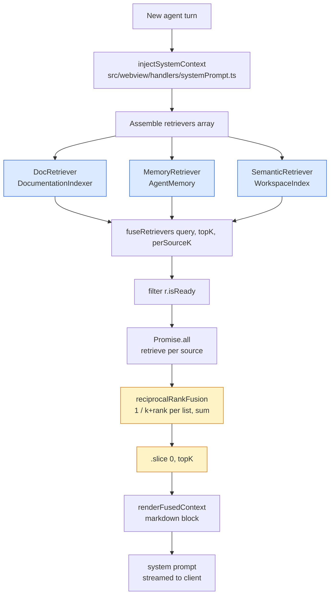
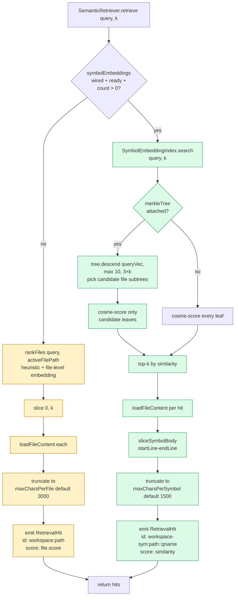
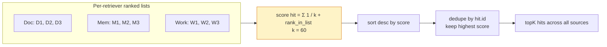

# Context Selection Pipeline

Before every agent turn, SideCar assembles a system prompt that includes retrieved context relevant to the user's query. The retrieval layer fuses three independent sources — documentation, agent memory, and the workspace itself — under a single shared budget using reciprocal-rank fusion (RRF). This keeps one noisy source from dominating the limited context window.

## Assembly flow

Each retriever implements the `Retriever` interface in [`src/agent/retrieval/retriever.ts`](../src/agent/retrieval/retriever.ts): `isReady()` and `retrieve(query, k) → RetrievalHit[]`. `fuseRetrievers` silently skips retrievers that aren't ready, Promise.all's the rest, catches per-retriever throws (so one failing source doesn't kill the others), then feeds the ranked lists into RRF. The output is capped at `topK` hits and rendered as a single markdown block prepended to the system prompt.

## Inside SemanticRetriever (the workspace source)

The workspace retriever has two paths — a v0.62+ symbol-level path that ships with PKI, and a legacy file-level path for when PKI isn't wired. Knowing which path you're on matters for understanding why a query surfaced what it did.

**Symbol path** (PKI enabled, v0.62+):

- Every parsed symbol's body is embedded (MiniLM, 384-dim) and stored in a `FlatVectorStore` keyed by `filePath::qualifiedName`.
- When `sidecar.merkleIndex.enabled` (default `true`), a content-addressed Merkle tree sits over the vector store. Aggregated file-node embeddings let `descend(queryVec, k)` pick candidate subtrees *before* scoring leaves, turning `O(total symbols)` cosine scans into `O(picked files × avg symbols per file)`.
- Hit IDs use a `workspace-sym:` prefix so the RRF fusion layer dedupes symbol hits independently from any legacy file-level hit that might still arrive from a parallel retriever in hybrid test setups.
- Hit content renders as a fenced code block with the symbol's line-range slice — a tighter "evidence unit" than a file head.

**File path** (legacy, pre-PKI or PKI unavailable):

- `WorkspaceIndex.rankFiles` blends heuristic scoring (path-locality to the active file, file-name token overlap, recent-edit boost) with a file-level embedding over first-N-bytes MiniLM vectors.
- Top-k file contents load, truncate to `maxCharsPerFile`, and emit with a `workspace:` ID prefix.

The retriever prefers symbol-level when available (PKI wired + ready + non-empty). Empty symbol search returns `[]` (not `null`) — that's a PKI result, just a negative one, and the caller doesn't fall through to file-level. The fall-through triggers only when PKI genuinely isn't usable yet (still warming up, disabled, or `getCount() === 0`).

## Reciprocal-rank fusion

RRF works well for this problem because it only needs **ordinal rank** from each source, not comparable score distributions. A doc retriever scoring in `[0, 1]` cosine similarity and a memory retriever scoring in arbitrary BM25 units both contribute the same way — rank 1 in each list is worth `1 / (60 + 1)`, rank 2 is `1 / (60 + 2)`, and so on. The `k=60` constant is standard (from the IR literature) and is not tunable from config; changing it would require re-baselining the RAG-eval suite.

## Budget + sizing knobs

- **Per-source K** — each retriever is asked for `perSourceK` items (default: `topK`). The fusion layer then picks `topK` across the union. Giving each source extra headroom means a weaker retriever can still contribute lower-ranked items when the stronger one also has matches.
- **Char caps per hit**:
  - Symbol hits: `sidecar.projectKnowledge.maxCharsPerSymbol` (default 1500).
  - File hits: `SemanticRetriever.maxCharsPerFile` (default 3000).
  - Doc hits + memory hits: each source owns its own truncation upstream.
- **System-prompt budget** — injected context is capped at the system block's overall byte cap so it can't crowd out the conversation history. When the combined hits exceed the cap, the fusion output is sliced in order — highest-ranked hits survive.

## Observability

The RAG-eval harness at [`src/test/retrieval-eval/`](../src/test/retrieval-eval/) runs every golden case through the metrics suite (`contextPrecisionAtK`, `contextRecallAtK`, `f1ScoreAtK`, `reciprocalRank`) and a CI ratchet in [`baseline.test.ts`](../src/test/retrieval-eval/baseline.test.ts) gates retrieval quality against floor thresholds. An LLM-as-judge layer at `tests/llm-eval/retrieval.eval.ts` runs under `npm run eval:llm` and adds `Faithfulness` + `AnswerRelevancy` scoring.

## Source layout

| File | Role |
| --- | --- |
| [`src/agent/retrieval/index.ts`](../src/agent/retrieval/index.ts) | `fuseRetrievers` + `renderFusedContext` — the public fusion entrypoint |
| [`src/agent/retrieval/retriever.ts`](../src/agent/retrieval/retriever.ts) | `Retriever` interface + `RetrievalHit` type |
| [`src/agent/retrieval/fusion.ts`](../src/agent/retrieval/fusion.ts) | `reciprocalRankFusion` — pure function, side-effect-free |
| [`src/agent/retrieval/docRetriever.ts`](../src/agent/retrieval/docRetriever.ts) | Wraps `DocumentationIndexer` |
| [`src/agent/retrieval/memoryRetriever.ts`](../src/agent/retrieval/memoryRetriever.ts) | Wraps `AgentMemory` |
| [`src/agent/retrieval/semanticRetriever.ts`](../src/agent/retrieval/semanticRetriever.ts) | Wraps `WorkspaceIndex`; branches on PKI readiness |
| [`src/config/symbolEmbeddingIndex.ts`](../src/config/symbolEmbeddingIndex.ts) | `SymbolEmbeddingIndex` — symbol-level vector store + optional Merkle descent |
| [`src/config/merkleTree.ts`](../src/config/merkleTree.ts) | Content-addressed hash tree over symbol leaves |
| [`src/config/vectorStore.ts`](../src/config/vectorStore.ts) | `VectorStore<M>` interface + `FlatVectorStore<M>` |
| [`src/config/workspaceIndex.ts`](../src/config/workspaceIndex.ts) | File-level index used by the legacy path |
| [`src/webview/handlers/systemPrompt.ts`](../src/webview/handlers/systemPrompt.ts) | `injectSystemContext` — the caller that assembles retrievers and renders into the prompt |
