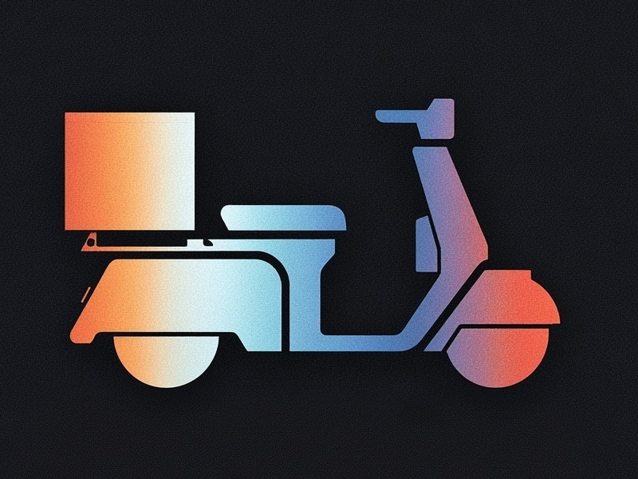

  
  
SideCar

  

    A free, open-source, local-first AI coding assistant for VS Code.
    No subscriptions. No data leaving your machine. No vendor lock-in.
  

  

    🔒 Fully Offline
    🤖 Agentic
    🛠️ Tool Use
    🧠 MCP Support
    🆓 MIT License
  

  

    <a href="getting-started" class="hero-btn hero-btn-primary">Get Started</a>
    <a href="https://marketplace.visualstudio.com/items?itemName=nedonatelli.sidecar-ai" class="hero-btn hero-btn-secondary">Install from Marketplace</a>
  

---

## Why SideCar?

Most local AI extensions for VS Code are chat wrappers or autocomplete plugins. SideCar is a **full agentic coding assistant** — closer to Claude Code or Cursor than to a chatbot.

  

    
🔄

    <h3>Autonomous Agent Loop</h3>
    
Multi-step reasoning with tool use — reads files, writes code, runs tests, and iterates until the task is done.

  

  

    
📝

    <h3>File Read / Write / Edit</h3>
    
Directly creates, edits, and manages files in your workspace with diff preview and one-click undo.

  

  

    
🖥️

    <h3>Shell Commands & Tests</h3>
    
Runs commands, executes test suites, and uses the output to fix issues — all from the chat.

  

  

    
🔐

    <h3>Security Scanning</h3>
    
Built-in secrets detection and vulnerability patterns. Scan staged files before every commit.

  

  

    
🔌

    <h3>MCP Servers</h3>
    
Extend SideCar with Model Context Protocol servers for databases, APIs, browser automation, and more.

  

  

    
🌿

    <h3>Git Integration</h3>
    
Stage, commit, push, pull, branch, and stash — all through natural language. Auto-generated commit messages.

  

---

## How SideCar compares

| Capability | SideCar | Continue | Llama Coder | Twinny | Copilot (free) |
|---|---|---|---|---|---|
| Chat with local models | Yes | Yes | No | Yes | Yes |
| Inline completions | Yes | Yes | Yes | Yes | Yes |
| Autonomous agent loop | **Yes** | No | No | No | No |
| File read/write/edit tools | **Yes** | No | No | No | No |
| Run commands & tests | **Yes** | No | No | No | No |
| Security & secrets scanning | **Yes** | No | No | No | No |
| MCP server support | **Yes** | No | No | No | No |
| Git integration (commit, PR) | **Yes** | No | No | No | No |
| Diff preview & undo/rollback | **Yes** | No | No | No | No |
| Fully offline / self-hosted | Yes | Yes | Yes | Yes | No |
| Free & open-source | Yes | Yes | Yes | Yes | Freemium |

---

## Quick start

1. Install [Ollama](https://ollama.com)
2. Install [SideCar from the VS Code Marketplace](https://marketplace.visualstudio.com/items?itemName=nedonatelli.sidecar-ai)
3. Click the SideCar icon in the activity bar
4. Start chatting — SideCar launches Ollama automatically

See the [Getting Started](getting-started) guide for more details.

---

## Requirements

- **[Ollama](https://ollama.com)** installed and in your PATH (for local models)
- **Visual Studio Code** 1.88.0 or later

---

SideCar will always be free. Tips not required but appreciated.

