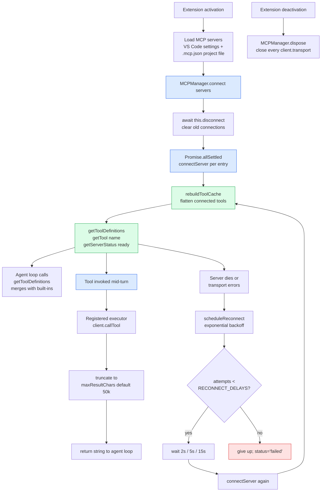
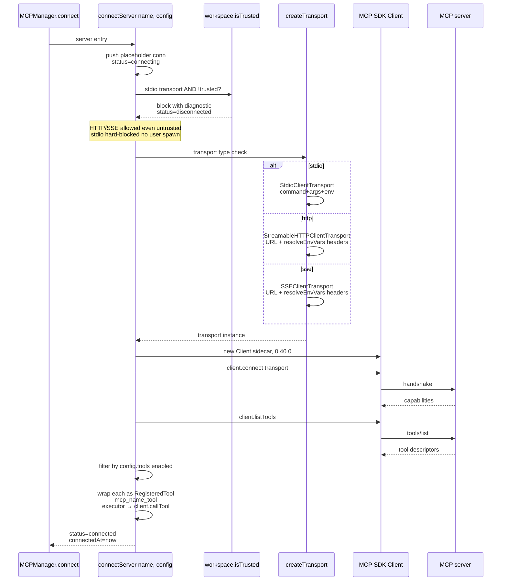
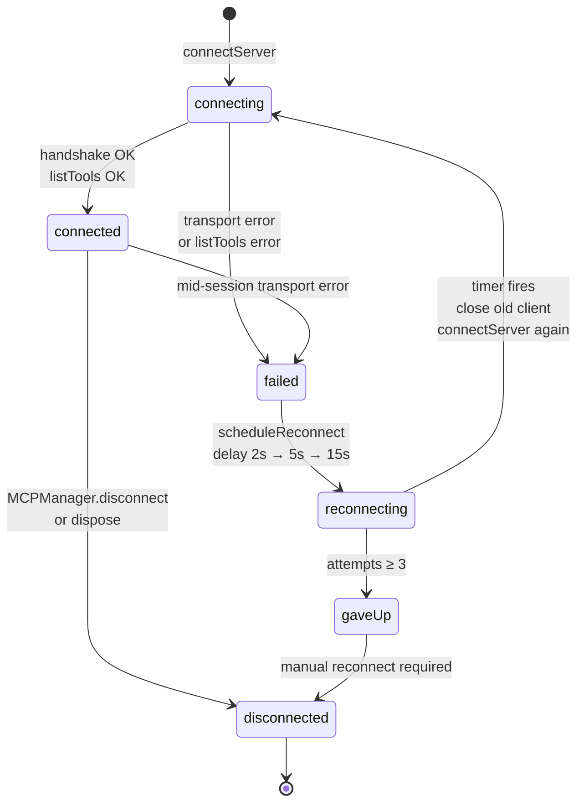
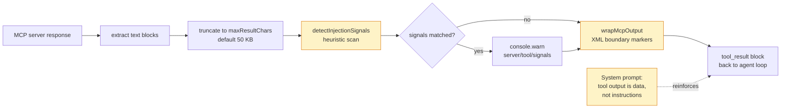

# MCP Client Lifecycle

The [Model Context Protocol](https://modelcontextprotocol.io/) lets SideCar consume tools from external servers — GitHub, Linear, Postgres, whatever the user wires up. [`MCPManager`](../src/agent/mcpManager.ts) is the single class that owns the connection pool, tool discovery, reconnect backoff, and tool invocation surface.

## End-to-end lifecycle



## Connect-one-server detail

`connectServer` is where all the per-server policy lives: trust gating, transport selection, env-var expansion scope, tool discovery + filtering, and reconnect scheduling on failure.



### Three transports

| Transport | Entry in config | SDK class | When blocked |
| --- | --- | --- | --- |
| **stdio** | `command` + `args` + optional `env` | `StdioClientTransport` | Workspace not trusted — spawning arbitrary commands from a cloned repo's `.mcp.json` is a non-starter until the user accepts the workspace-trust prompt |
| **http** | `url` + optional `headers` | `StreamableHTTPClientTransport` | — (no local process spawn) |
| **sse** | `url` + optional `headers` | `SSEClientTransport` | — (no local process spawn) |

### Env-var expansion is scoped

Headers may reference `${VAR}` placeholders. Expansion **only** looks at the server's own `env` block, **not** at `process.env`. A malicious `.mcp.json` that set `headers: { Authorization: "${ANTHROPIC_API_KEY}" }` would otherwise exfiltrate SideCar's own API key to the remote server. Unresolved placeholders become empty strings.

### Tool naming + approval

Every MCP tool surfaces to the model as `mcp_<server>_<tool>`. The namespace prefix avoids collisions with built-ins and across MCP servers. Every MCP tool is registered with `requiresApproval: true` — SideCar doesn't know what an arbitrary MCP tool does, so the default is "user must click Allow."

## Reconnect with exponential backoff



`RECONNECT_DELAYS = [2000, 5000, 15000]` — three tries, then the connection stays `failed` until the user explicitly triggers a reconnect (usually via `MCPManager.connect(servers)` with fresh settings). The backoff keeps one dead server from hammering itself against a down endpoint forever; the cap prevents retries during an extension shutdown from leaking timers.

## Tool invocation path

When the agent loop dispatches an MCP tool:

1. `executeToolUses` looks up the tool via `MCPManager.getTool(name)` (or via the merged catalog — `getToolDefinitions()` was folded into the LLM-facing list at agent-start).
2. Approval gate runs (MCP tools default to `requiresApproval: true` — see the [tool system doc](tool-system-diagram.md) for the gate logic).
3. `args` are redacted for secrets before logging.
4. Registered executor calls `client.callTool({ name: mcpTool.name, arguments: input })` — note the executor strips the `mcp_<server>_` prefix before sending.
5. The result's `content` array is rendered: `text` blocks concatenated verbatim, other block types JSON-stringified.
6. Output is truncated to `config.maxResultChars` (default 50 KB) so a chatty MCP tool can't blow out the agent's context window.
7. **`detectInjectionSignals`** (v0.62.4) scans the body for common indirect-prompt-injection patterns (`ignore previous instructions`, fake `SYSTEM:` roles, `<|im_start|>`, etc.). Matches log a `console.warn` with the server + tool name and the matched signal set. Detection is advisory — never blocking, never mutating the content — because false positives on legitimate tool output would be worse than the signal's marginal detection value.
8. **`wrapMcpOutput`** (v0.62.4) unconditionally wraps the output in `<mcp_tool_output server="…" tool="…" trust="untrusted">…</mcp_tool_output>` boundary markers. The LLM already treats tool output as untrusted data (per the standing rule in the base system prompt), but the boundary marker reinforces that contract per-call and attributes each chunk to a specific server, so a malicious response can't masquerade as first-party tool output. Server/tool names are sanitized to `[a-zA-Z0-9._-]` so they can't break out of the attribute context.

### Indirect-prompt-injection defense layers



The three layers stack:

- **Base layer** (always on) — system prompt tells the LLM to treat all tool output as untrusted data. This applies to MCP, `read_file`, `web_search`, `git_log`, etc.
- **Attribution layer** (v0.62.4) — boundary markers tag MCP output with server + tool names so the LLM can apply extra skepticism to code from unaudited sources. Unconditional; no config knob.
- **Observability layer** (v0.62.4) — heuristic detector flags likely injection attempts in the SideCar output channel so users can investigate before the agent acts on suspicious content. Logging only.

## Status surface for UI

`getServerStatus()` returns `MCPServerInfo[]` for the chat panel's status view:

```typescript
{
  name: string;
  status: 'connected' | 'connecting' | 'failed' | 'disconnected';
  toolCount: number;          // tools discovered, post-filter
  transport: 'stdio' | 'http' | 'sse';
  error?: string;             // human-readable on failed
  connectedSinceMs?: number;  // uptime since last successful connect
}
```

The chat panel polls this on open + whenever it re-renders the agent-mode picker, so users can see which servers are live and how long they've been up.

## Source layout

| File | Role |
| --- | --- |
| [`src/agent/mcpManager.ts`](../src/agent/mcpManager.ts) | `MCPManager` class + `MCPConnection` + `MCPServerInfo` |
| [`src/config/settings.ts`](../src/config/settings.ts) | `MCPServerConfig` type; merges VS Code settings + `.mcp.json` |
| `@modelcontextprotocol/sdk/client/*` | Third-party SDK for the protocol itself |

## User-facing docs

[`docs/mcp-servers.md`](mcp-servers.md) has the user-level config guide (per-server enable/disable, `.mcp.json` schema, trust-prompt behavior). This file covers the internal lifecycle.
