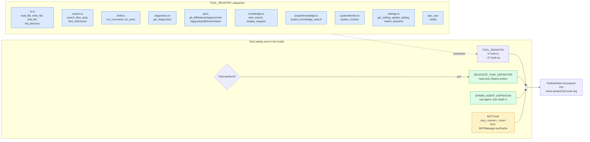
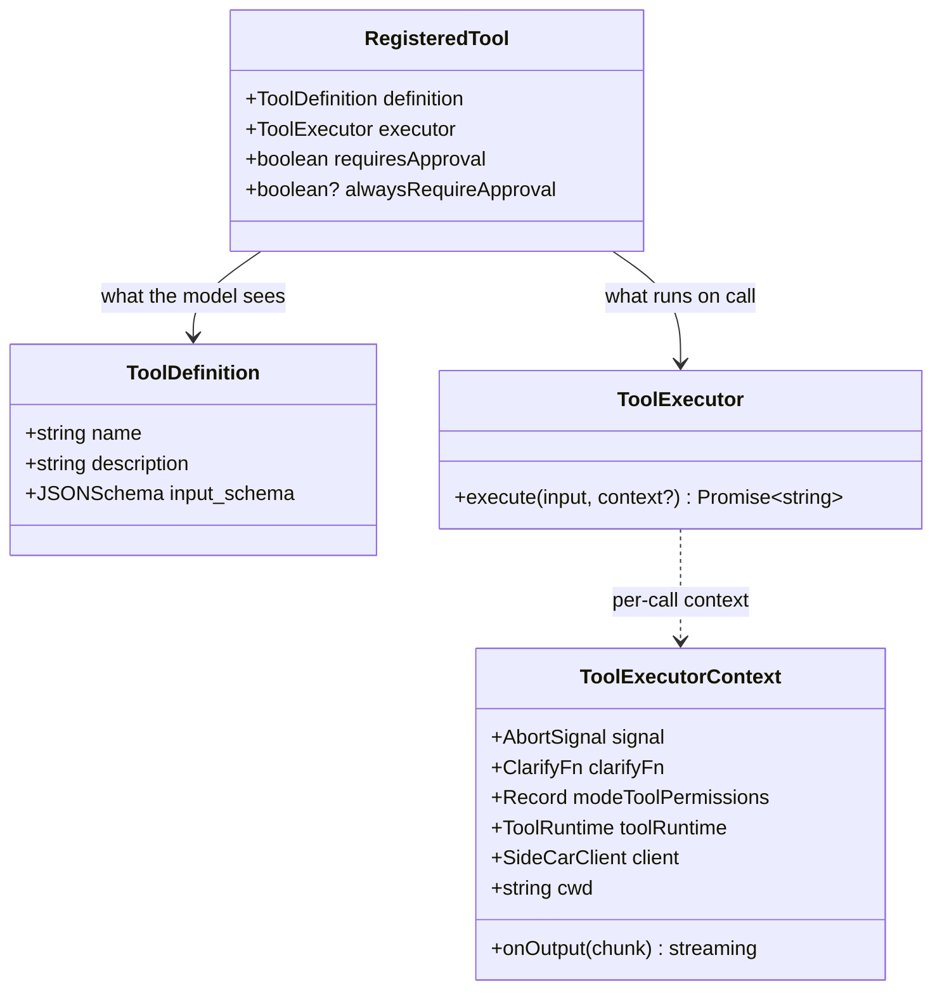
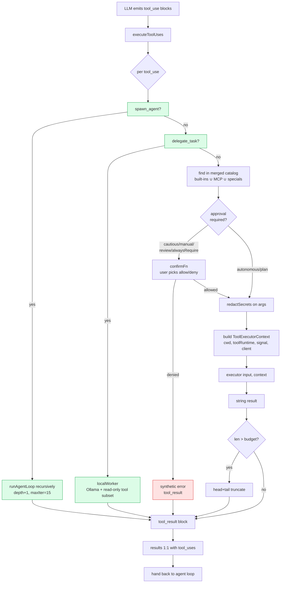

# Tool Registry & Dispatch

The tool system exposes the agent's full capability surface as a flat list of `RegisteredTool` entries. The LLM sees just the `ToolDefinition` (name + description + JSON schema) and emits `tool_use` content blocks; the loop then hands those to an executor function that produces the string result the model sees next turn.

## Registry composition

- **Built-ins** are composed in [`src/agent/tools.ts`](../src/agent/tools.ts) from per-category modules under [`src/agent/tools/`](../src/agent/tools/). Each category file owns its own definitions + executors; `tools.ts` is the slim composition layer.
- **`delegate_task`** is only exposed when the active backend is paid (Anthropic / OpenAI / etc.) — the whole point is offloading read-only research to a free local Ollama worker, so on local-first setups it's a no-op and hidden from the catalog to save the orchestrator tokens.
- **`spawn_agent`** spawns a nested `runAgentLoop` with `maxIterations=15`. `MAX_AGENT_DEPTH = 3` prevents runaway recursion.
- **MCP tools** are discovered at `MCPManager.connect()` time and flattened into a single `toolCache`. Each MCP tool is prefixed `mcp_<server>_<tool>` to namespace against collisions.

## Shape of a RegisteredTool

The `ToolExecutorContext` is built fresh for every dispatch and carries:

- **`onOutput`** — streaming callback for long-running tools (shell commands, test runs).
- **`signal`** — abort signal threaded from the agent loop's top-level controller.
- **`clarifyFn`** — hook that lets `ask_user` raise an interactive prompt.
- **`modeToolPermissions`** — per-tool permission overrides from the active custom mode.
- **`toolRuntime`** — per-run `ToolRuntime` carrying the persistent shell session + symbol graph. Background agents get distinct runtimes so shell state (cwd, env, aliases) doesn't cross-contaminate.
- **`client`** — the active `SideCarClient`, exposed so `git_commit` can call `client.buildModelTrailers()` to embed `X-AI-Model` git trailers.
- **`cwd`** — working-directory override. Shadow Workspaces set this to `.sidecar/shadows/<task-id>/` so every fs tool's relative-path resolution lands in the shadow worktree instead of the main tree.

## Dispatch pipeline

## Approval gates

Approval is resolved per call from three inputs that combine to pick one of `allow` / `ask` / `deny`:

1. **`RegisteredTool.alwaysRequireApproval`** — when `true`, the user is prompted on every call regardless of anything else. Reserved for tools that change SideCar's own runtime state (`switch_backend`, `update_setting`). The user's durable configuration never changes without an explicit click.
2. **`modeToolPermissions`** (per-mode override) and **global `sidecar.toolPermissions`** — per-tool `allow` / `ask` / `deny`. Mode overrides win over global.
3. **Agent mode** — the coarse-grained tier:
   - `cautious` — ask before every mutating tool.
   - `autonomous` — run without asking (subject to `alwaysRequireApproval`).
   - `manual` — user approves every step, even read-only ones.
   - `plan` — first iteration generates a plan for explicit approval, then autonomous.
   - `review` — writes divert into a pending-review TreeView via `pendingEdits`; user accepts per-file before they touch disk.
   - `audit` — writes divert into the atomic `AuditBuffer`; the user accepts the whole batch in one click.

See [`agent-mode.md`](agent-mode.md) for the full matrix.

## Tool categories

| File | Tools | Approval |
| --- | --- | --- |
| [`fs.ts`](../src/agent/tools/fs.ts) | `read_file`, `write_file`, `edit_file`, `list_directory` | writes require approval |
| [`search.ts`](../src/agent/tools/search.ts) | `search_files`, `grep`, `find_references` | none |
| [`shell.ts`](../src/agent/tools/shell.ts) | `run_command`, `run_tests` | always require approval |
| [`diagnostics.ts`](../src/agent/tools/diagnostics.ts) | `get_diagnostics` | none |
| [`git.ts`](../src/agent/tools/git.ts) | `git_diff`, `git_status`, `git_stage`, `git_commit`, `git_log`, `git_push`, `git_pull`, `git_branch`, `git_stash` | mutating ops require approval |
| [`knowledge.ts`](../src/agent/tools/knowledge.ts) | `web_search`, `display_diagram` | none |
| [`projectKnowledge.ts`](../src/agent/tools/projectKnowledge.ts) | `project_knowledge_search` — PKI symbol-level RAG | none |
| [`systemMonitor.ts`](../src/agent/tools/systemMonitor.ts) | `system_monitor` | none |
| [`settings.ts`](../src/agent/tools/settings.ts) | `get_setting`, `update_setting`, `switch_backend` | update/switch always require approval |
| (inline in tools.ts) | `ask_user` — clarifying prompt | handled by executor, not the normal dispatch path |
| (inline) | `spawn_agent`, `delegate_task` | special-cased in `executeToolUses` |

Adding a tool usually means extending the relevant category file and re-exporting; the slim composition layer in [`tools.ts`](../src/agent/tools.ts) then picks it up automatically.
